# Content OS — Complete Codebase Flowchart
> **Senior Developer Scan** · Source: `FluentFlier/dispatch` · Tools: CodeGraph + manual file-by-file review
> Every node below maps 1:1 to real source files and function names.

---

## 0. Project Overview

```
Next.js 14 (App Router) · InsForge BaaS · Stripe billing · Ayrshare social API · Supermemory · Claude AI
Stack: TypeScript · Tailwind CSS · Remotion (video)
```

The app implements a **5-stage closed Content Loop**:

```
Signal ──► Draft ──► Publish ──► Reply ──► Learn
(Research)  (AI Gen)  (Queue)   (Inbox)  (Brain/Analytics)
```

---

## 1. Application Entry & Routing

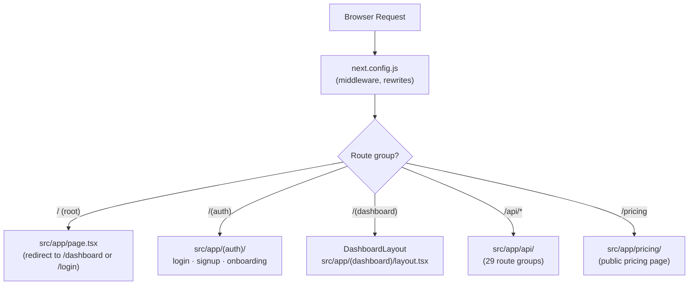

### 1.1 Dashboard Layout Guard (`src/app/(dashboard)/layout.tsx`)
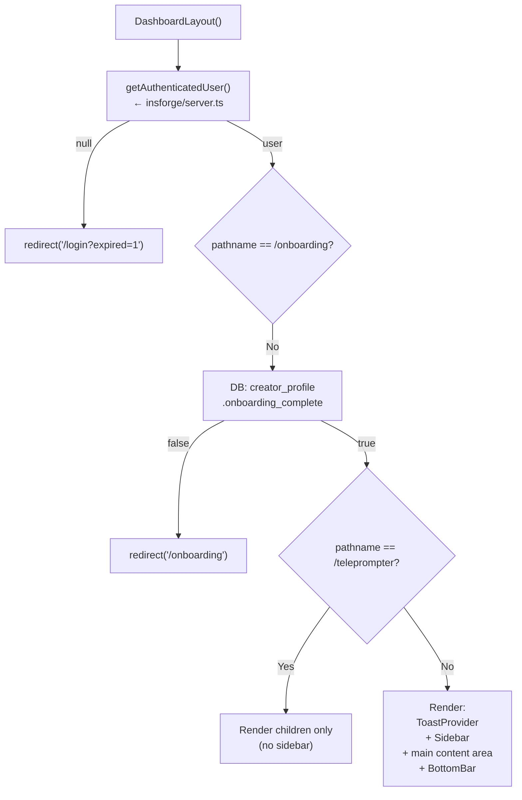

---

## 2. Authentication Layer

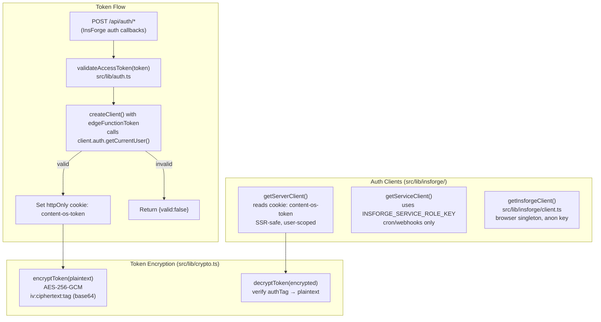

> **Auth guard**: Every protected API route calls `getAuthenticatedUser()` first (20+ callers confirmed by CodeGraph).

---

## 3. Cross-Cutting Concerns

### 3.1 Rate Limiting & AI Guard (`src/lib/ai-guard.ts` + `src/lib/rate-limit.ts`)

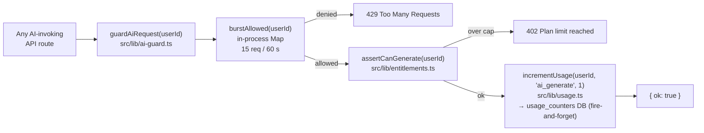

> **12 callers** of `guardAiRequest`: auto-generate, draft-replies, generate, humanize, optimize, research, trends/detect, video/auto-edit, video/generate, voice-lab/analyze, voice-lab/import, voice-lab/interview.

### 3.2 Entitlements & Plan Limits (`src/lib/entitlements.ts`)

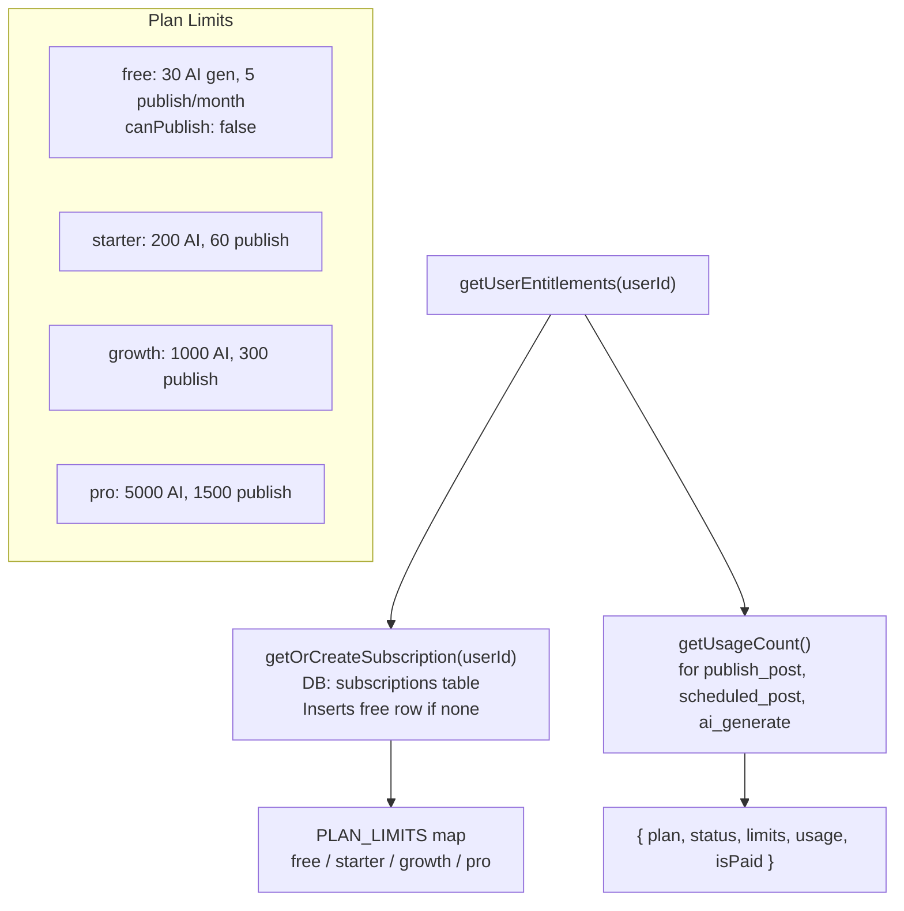

### 3.3 Usage Tracking (`src/lib/usage.ts`)

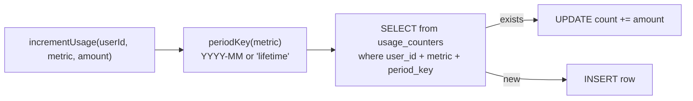

### 3.4 Env Validation (`src/lib/env.ts`)

| Function | What it checks |
|---|---|
| `isProduction()` | `NODE_ENV === 'production'` |
| `getSocialProviderMode()` | `SOCIAL_PROVIDER_MODE` env → `'ayrshare'` or `'direct'` |
| `assertProductionEnv()` | 5 required prod vars + TOKEN_ENCRYPTION_KEY must be 64 hex chars |
| `getAppUrl()` | `NEXT_PUBLIC_APP_URL` or localhost |

---

## 4. Stage 1 — Signal (Research)

**Route**: `POST /api/research/route.ts`
**Connected**: `src/lib/hooks-intelligence/supervisor-agent.ts`

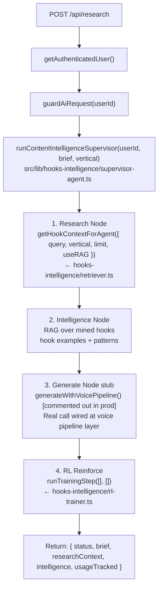

### Hook Intelligence System (`src/lib/hooks-intelligence/`)

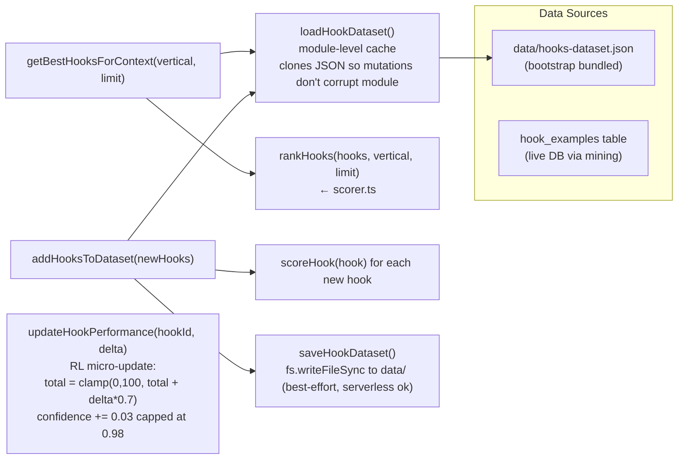

> **Social Listening** (`runSocialListening`): Reads `DEFAULT_WATCHLIST.accounts`, sorts by priority, returns top N. Comment says "would call gstack extractor in prod" — currently just returns the watchlist array.

---

## 5. Stage 2 — Draft (AI Generation)

### 5.1 Generation Route (`POST /api/generate/route.ts`)

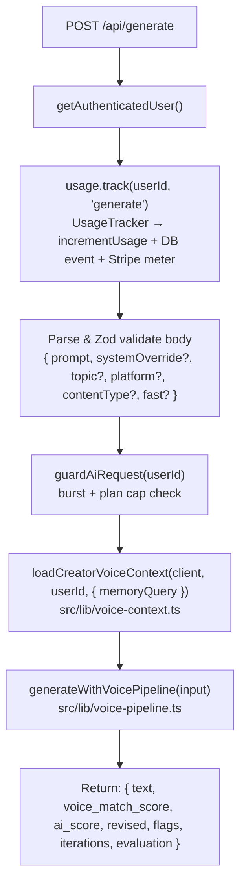

### 5.2 Voice Context Loader (`src/lib/voice-context.ts`)

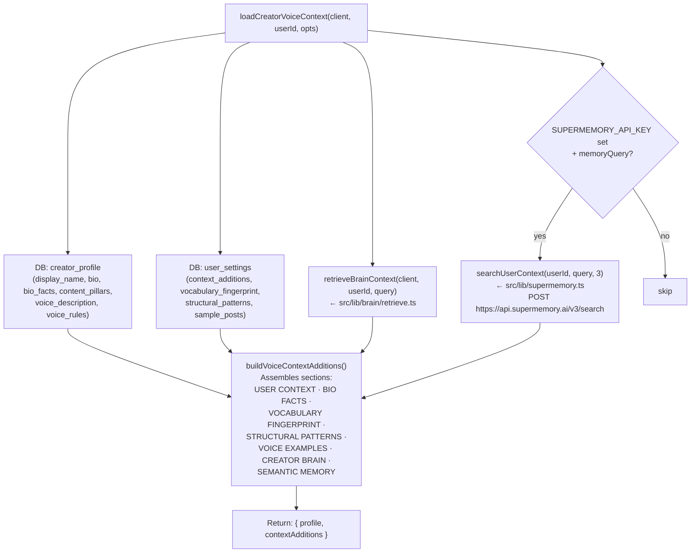

### 5.3 Voice Pipeline (`src/lib/voice-pipeline.ts`)

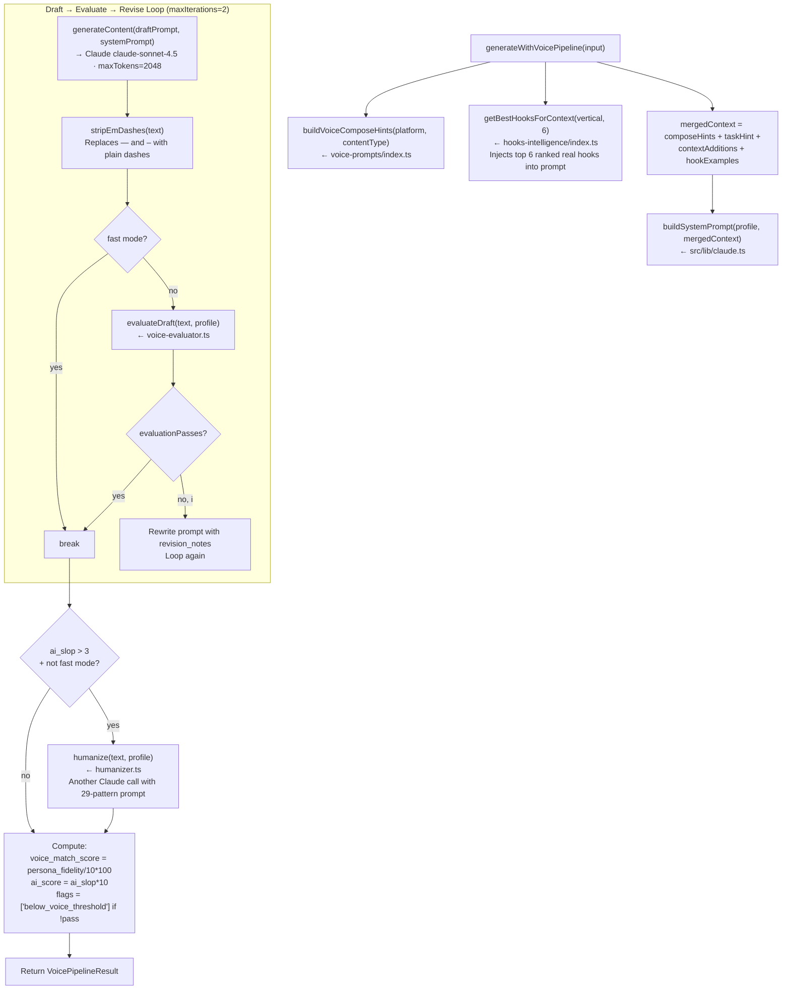

### 5.4 Voice Evaluator (`src/lib/voice-evaluator.ts`)

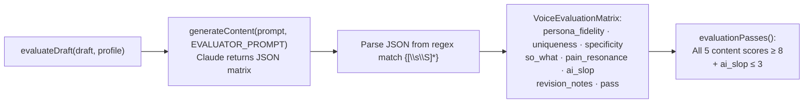

### 5.5 Claude AI Client (`src/lib/claude.ts`)

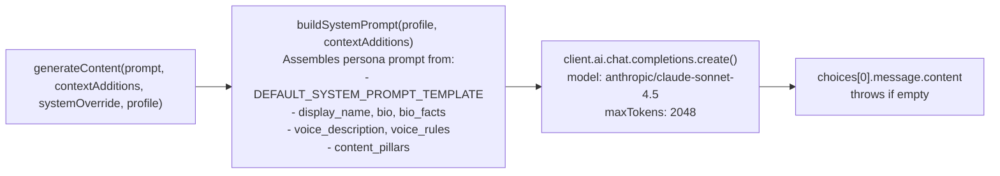

### 5.6 Auto-Optimize (`src/lib/auto-optimize.ts`)

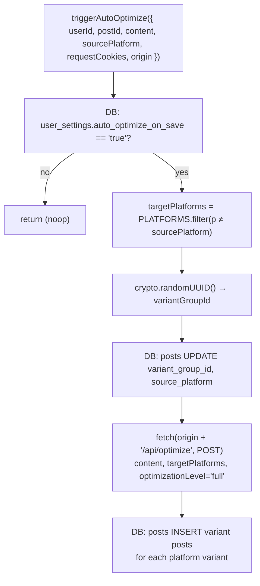

---

## 6. Stage 3 — Publish

### 6.1 Publish Route (`POST /api/publish/route.ts`)

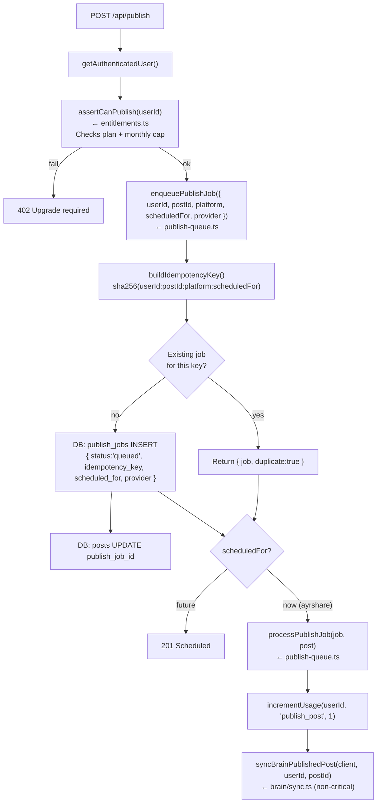

### 6.2 Publish Queue Processor (`src/lib/publish-queue.ts`)

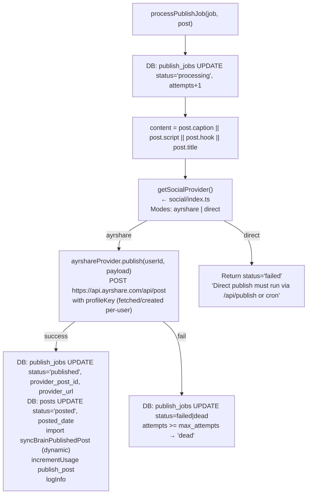

### 6.3 Cron Publish Worker (`GET /api/cron/publish/route.ts`)

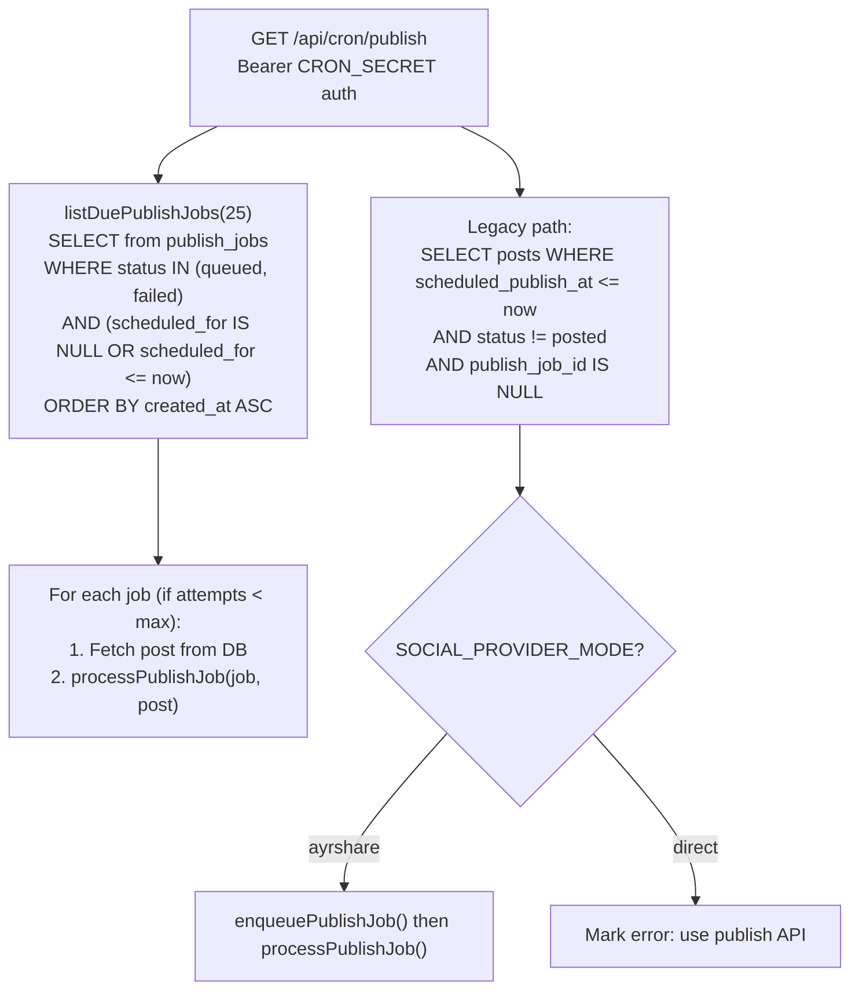

### 6.4 Social Provider Abstraction (`src/lib/social/`)

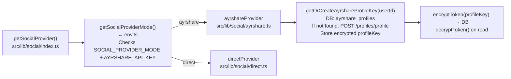

---

## 7. Stage 4 — Reply (Engagement Inbox)

### 7.1 Engagement Inbox (`src/lib/engagement/inbox.ts`)

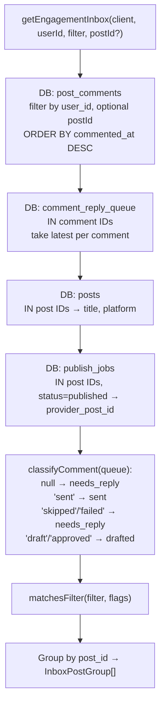

### 7.2 Draft Engagement Replies (`src/lib/engagement/inbox.ts → draftEngagementReplies`)

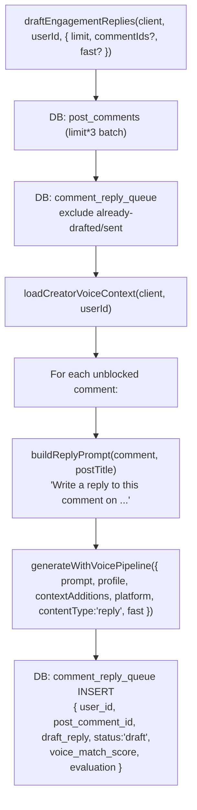

### 7.3 Send Engagement Replies (`draftEngagementReplies → sendEngagementReplies`)

```mermaid
flowchart TD
    SER["sendEngagementReplies(client, userId, { queueIds?, approveFirst?, draftOverrides? })"] --> QQ2["DB: comment_reply_queue\nFilter: queueIds OR status='approved'/'draft'"]
    QQ2 --> CMT2["DB: post_comments → commentMap"]
    CMT2 --> USEAYR{"ayrshareCommentsAvailable()\n= AYRSHARE_API_KEY set?"}
    USEAYR -->|"yes"| SAR["sendAyrshareCommentReply()\nPOST https://api.ayrshare.com/api/comments/reply/:id\nBody: { platforms, comment, searchPlatformId }"]
    USEAYR -->|"no"| STUB["stubbed=true (no-op reply)"]
    SAR & STUB --> UPDQ["DB: comment_reply_queue UPDATE\nstatus='sent', sent_at, provider_reply_id"]
```

### 7.4 Engagement Sync (`POST /api/engagement/sync/route.ts`)

- Fetches new comments from Ayrshare (`fetchAyrsharePostComments`)
- Upserts into `post_comments` table
- Triggered manually or by cron

---

## 8. Stage 5 — Learn (Brain & Analytics)

### 8.1 Creator Brain (`src/lib/brain/sync.ts`)

```mermaid
flowchart TD
    PCB["provisionCreatorBrain(client, userId)"] --> LBP["listBrainPages(client, userId)"]
    LBP -->|"already ≥ 2 pages"| DONE["return (already provisioned)"]
    LBP -->|"new"| INITPAGES["putBrainPage → voice page (pending)\nputBrainPage → profile page (pending)\nputBrainPage → 'What works' page (empty)"]

    SBF["syncBrainFromProfile(client, userId)"] --> QP3["DB: creator_profile\ndisplay_name, bio, bio_facts, voice*, content_pillars"]
    QP3 --> PBV["putBrainPage: voice slug\n{ voice_description, voice_rules, synced_at }"]
    QP3 --> PBP["putBrainPage: profile slug\n{ display_name, bio, bio_facts, content_pillars }"]

    SBPP["syncBrainPublishedPost(client, userId, postId)"] --> QP4["DB: posts → hook + script + caption"]
    QP4 --> PBPost["putBrainPage: post/{postId} slug\n{ post_id, platform, pillar, content[0..4000],\nviews, likes, posted_date }"]
    PBPost --> SBW["syncBrainWins(client, userId)\nTOP 5 posts by views\nputBrainPage: wins slug"]

    SCBF["syncCreatorBrainFull(client, userId)"] --> PCB
    SCBF --> SBF
    SCBF --> SBPP
```

### 8.2 Voice Lab (`src/lib/brain/sync.ts → syncBrainVoiceLab`)

```mermaid
flowchart TD
    SBVL["syncBrainVoiceLab(client, userId, payload)"] --> PCB2["provisionCreatorBrain()"]
    PCB2 --> GBP["getBrainPage(client, userId, BRAIN_SLUG.voice)"]
    GBP --> MERGE["Merge existing brain page JSON with:\n{ voice_description, voice_rules,\nvocabulary_fingerprint, structural_patterns }"]
    MERGE --> PBV2["putBrainPage: voice slug"]
    PBV2 --> SBF2["syncBrainFromProfile()\nprofile page refresh"]
```

### 8.3 Hook RL Feedback Loop

```mermaid
flowchart LR
    POST_PERF["Post gets views/likes\n(pulled by engagement sync)"] --> UHP2["updateHookPerformance(hookId, delta)\nhooks-intelligence/index.ts\nRL micro-update:\ntotal = clamp(0,100, current.total + delta*0.7)\nconfidence = min(0.98, confidence + 0.03)"]
    UHP2 --> SAVE2["saveHookDataset()\nbest-effort file write\n(DB hook_examples is source of truth)"]
```

### 8.4 Analytics (`src/lib/analytics.ts`)

```mermaid
flowchart LR
    TE["trackEvent(event, properties)\n8 event types:\nsignup_complete · onboarding_complete · account_connected\nfirst_post_scheduled · first_publish_success\nupgrade_checkout_started · subscription_active · publish_failed"]
    TE --> LI["logInfo('analytics', payload)\n→ JSON to stdout"]
    TE --> WH{"ANALYTICS_WEBHOOK_URL set?"}
    WH -->|"yes"| POST_WH["POST webhook body (non-blocking)"]
    WH -->|"no"| NOOP["noop"]
```

---

## 9. Billing (Stripe)

```mermaid
flowchart TD
    subgraph "Checkout Flow"
        BCO["POST /api/billing/checkout/route.ts"] --> AU_B["getAuthenticatedUser()"]
        AU_B --> GS_ENT["getUserEntitlements(userId)"]
        GS_ENT --> GCS["createStripeCustomer(email, userId)\nPOST stripe /customers"]
        GCS --> CCS["createCheckoutSession({ customerId, priceId, successUrl, cancelUrl })\nPOST stripe /checkout/sessions"]
        CCS --> REDIR["Return Stripe checkout URL"]
    end

    subgraph "Webhook Flow"
        BWH["POST /api/billing/webhook/route.ts"] --> HSW["handleStripeWebhook(payload, signature)\nsrc/lib/stripe-webhook.ts"]
        HSW --> VSS["verifyStripeSignature()\nHMAC-SHA256 timing-safe compare"]
        VSS -->|"fail"| WH_ERR["400 Invalid signature"]
        VSS -->|"ok"| SWITCH{"event.type"}
        SWITCH -->|"checkout.session.completed"| UPS1["DB: subscriptions UPSERT\nplan=metadata.plan, status='active'\nstripe_customer_id, stripe_subscription_id"]
        SWITCH -->|"customer.subscription.updated/deleted"| LOOKUP["DB: subscriptions\nresolve userId from stripe_customer_id\n(fallback: metadata.user_id)"]
        LOOKUP --> UPS2["DB: subscriptions UPSERT\nmap status: active/trialing/past_due/canceled\nIf canceled: plan → 'free'"]
    end

    subgraph "Portal Flow"
        BPO["POST /api/billing/portal/route.ts"] --> CBPS["createBillingPortalSession(customerId, returnUrl)\nPOST stripe /billing_portal/sessions"]
        CBPS --> PREDIR["Return portal URL"]
    end
```

> **Plan → Limits mapping** is in `PLAN_LIMITS` in `entitlements.ts`. The Stripe webhook is the **only** way plans get activated/upgraded/canceled.

---

## 10. Workspace System (`src/lib/workspace.ts`)

```mermaid
flowchart TD
    EAW["getActiveWorkspace(userId)"] --> LW["listWorkspaces(userId)\nDB: workspace_members JOIN workspaces"]
    LW --> COOK["Check cookie: content-os-workspace"]
    COOK --> PICK["Pick: cookie match > solo type > first"]

    ESW["ensureSoloWorkspace(userId)"] --> LW2["listWorkspaces()"]
    LW2 -->|"empty"| CRSW["DB: workspaces INSERT solo\nDB: workspace_members INSERT owner"]

    CCW["createClientWorkspace(userId, name)"] --> CCAN["canCreateWorkspace()\nlistWorkspaces() + getUserEntitlements()\nLimit: free=1, starter=3, growth=10, pro=50"]
    CCAN -->|"allowed"| CRCW["DB: workspaces INSERT client\nDB: workspace_members INSERT owner"]
```

---

## 11. Full API Surface (29 Route Groups)

| Route | Methods | Purpose |
|---|---|---|
| `/api/analytics` | GET, POST | Analytics events read/write |
| `/api/auth/*` | POST | Token validation, session |
| `/api/auto-generate` | POST | Cron-driven auto content gen |
| `/api/billing/checkout` | POST | Start Stripe checkout |
| `/api/billing/portal` | POST | Stripe billing portal |
| `/api/billing/webhook` | POST | Stripe webhooks |
| `/api/brain/provision` | POST | Provision creator brain |
| `/api/brain/save` | POST | Save brain page |
| `/api/brain/status` | GET | Brain page list |
| `/api/brain/sync` | POST | Full brain sync |
| `/api/cron/publish` | GET | Scheduled publish cron (CRON_SECRET) |
| `/api/cron/auto-generate` | GET | Scheduled content generation |
| `/api/engagement/draft-replies` | POST | AI-draft comment replies |
| `/api/engagement/inbox` | GET | Fetch engagement inbox |
| `/api/engagement/send` | POST | Send drafted replies |
| `/api/engagement/sync` | POST | Sync comments from Ayrshare |
| `/api/entitlements` | GET | User plan limits + usage |
| `/api/generate` | POST | Primary AI generation |
| `/api/hashtag-sets/[id]` | PATCH, DELETE | Hashtag set management |
| `/api/hooks` | GET, POST | Hook examples CRUD |
| `/api/humanize` | POST | AI humanize text |
| `/api/ideas` | GET, POST | Content ideas |
| `/api/optimize` | POST | Platform variant generation |
| `/api/posts` | GET, POST, PATCH, DELETE | Post CRUD |
| `/api/publish` | POST | Immediate/scheduled publish |
| `/api/publish-jobs` | GET | List publish jobs |
| `/api/research` | POST | Hook Intelligence supervisor |
| `/api/series` | GET, POST, PATCH, DELETE | Content series |
| `/api/settings` | GET, POST | User settings |
| `/api/social-accounts` | GET | Connected social accounts |
| `/api/story-bank` | GET, POST, DELETE | Story bank |
| `/api/trends/detect` | POST | Trend detection |
| `/api/upload` | POST | File upload |
| `/api/video/*` | POST | Video gen, auto-edit |
| `/api/voice-lab/analyze` | POST | Voice analysis |
| `/api/voice-lab/import` | POST | Import posts for voice |
| `/api/voice-lab/interview` | POST | Voice interview |
| `/api/weekly-reviews` | GET, POST | Weekly analytics |
| `/api/workspaces` | GET, POST | Workspace management |
| `/api/health` | GET | Health check |

---

## 12. Database Schema (Inferred from Code)

| Table | Key Columns | Purpose |
|---|---|---|
| `creator_profile` | `user_id`, `display_name`, `bio`, `bio_facts`, `content_pillars`, `voice_description`, `voice_rules`, `onboarding_complete` | User profile + voice identity |
| `posts` | `id`, `user_id`, `title`, `platform`, `pillar`, `status`, `caption`, `script`, `hook`, `views`, `likes`, `scheduled_publish_at`, `publish_job_id`, `variant_group_id`, `source_platform`, `posted_date` | Content items |
| `publish_jobs` | `id`, `user_id`, `post_id`, `platform`, `status`, `idempotency_key`, `scheduled_for`, `attempts`, `max_attempts`, `last_error`, `provider`, `provider_post_id`, `provider_url` | Durable publish queue |
| `subscriptions` | `user_id`, `plan`, `status`, `stripe_customer_id`, `stripe_subscription_id`, `current_period_start`, `current_period_end` | Billing/plan data |
| `usage_counters` | `user_id`, `metric`, `period_key`, `count` | Monthly usage tracking |
| `usage_events` | `user_id`, `action`, `metadata`, `created_at` | Rich event log (best-effort) |
| `ayrshare_profiles` | `user_id`, `profile_key` (encrypted), `title` | Ayrshare per-user keys |
| `post_comments` | `id`, `user_id`, `post_id`, `platform`, `provider_comment_id`, `comment_text`, `author_name`, `author_handle`, `commented_at`, `synced_at` | Synced comments |
| `comment_reply_queue` | `id`, `user_id`, `post_comment_id`, `draft_reply`, `status`, `voice_match_score`, `evaluation`, `sent_at`, `provider_reply_id`, `last_error` | Reply drafts pipeline |
| `user_settings` | `user_id`, `key`, `value` | Key-value settings store |
| `workspaces` | `id`, `owner_user_id`, `name`, `type` | Workspace management |
| `workspace_members` | `workspace_id`, `user_id`, `role` | Workspace membership |
| `brain_pages` | `user_id`, `slug`, `title`, `tags`, `body` | Creator brain knowledge store |
| `hook_examples` | (inferred) | Live mined hook database |

---

## 13. Complete Data Flow Summary

```mermaid
flowchart TD
    USER["👤 Creator"] --> AUTH["Auth\n(InsForge → httpOnly cookie)"]
    AUTH --> DASH["Dashboard\n/(dashboard)/* pages"]
    DASH --> IDEA["Ideas / Trends\n/api/research · /api/ideas · /api/trends"]
    IDEA --> DRAFT["AI Draft\n/api/generate\nguardAiRequest → loadVoiceContext →\ngenerateWithVoicePipeline →\n(draft → eval → revise → humanize)"]
    DRAFT --> LIB["Post Library\n/api/posts\nsave draft/scripted/scheduled"]
    LIB --> PUB["Publish\n/api/publish → enqueuePublishJob\n→ processPublishJob → Ayrshare API"]
    PUB --> ENGMNT["Engagement Inbox\npost_comments (synced from Ayrshare)\n→ draftEngagementReplies\n→ sendAyrshareCommentReply"]
    ENGMNT --> BRAIN["Creator Brain\nsyncBrainPublishedPost\nupdateHookPerformance (RL)\nsyncBrainWins"]
    BRAIN --> IDEA

    STRIPE["Stripe"] --> WHK["Billing Webhook\n→ subscriptions table\n→ plan limits enforced"]
    WHK --> ENTITLE["Entitlements\nguardAiRequest · assertCanPublish"]
    ENTITLE --> DRAFT & PUB
```

---

*Generated by systematic CodeGraph traversal + line-by-line file review. Last scan: June 2026.*
